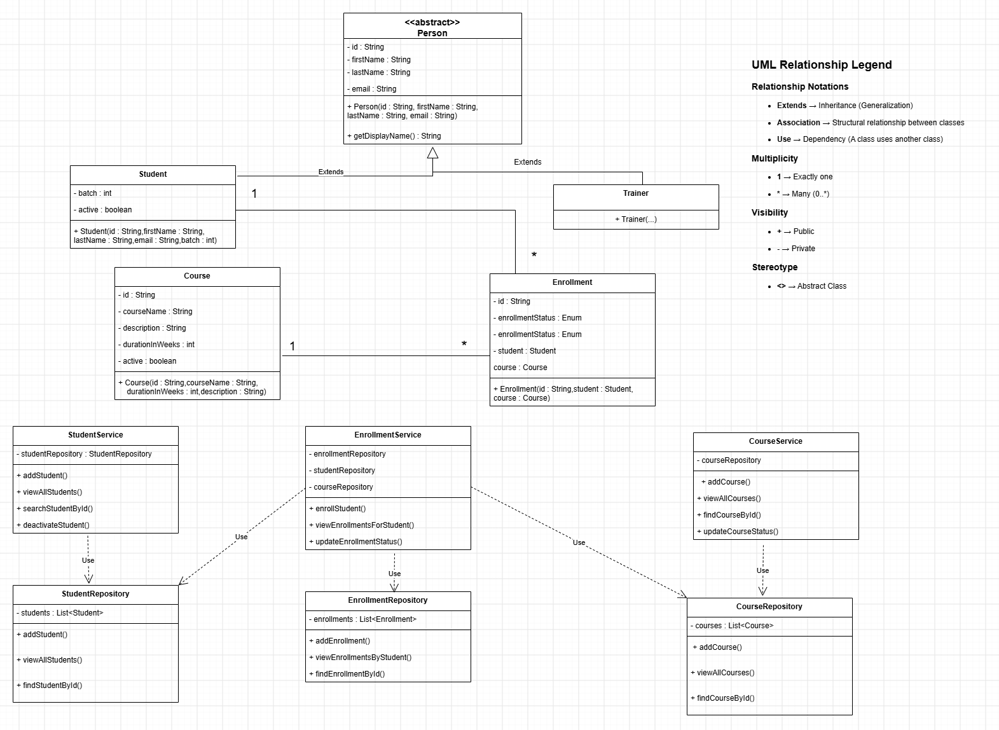

# UML Class Diagram

## Overview

The UML Class Diagram represents the overall architecture of the **LearnTrack Management System**. It illustrates the relationships between entities, services, repositories, utility classes, exceptions, enums, and constants.

The diagram follows a layered architecture consisting of:

* Entity Layer
* Repository Layer
* Service Layer
* Repository Layer
* Utility Layer
* Constants & Enums
* Exception Handling

## Relationship Types

* **Extends** – Represents inheritance.
* **Association** – Represents a structural relationship between classes.
* **Use** – Represents a dependency where one class uses another.

## Multiplicity

* **1** – Exactly one instance.
* ***** – Many instances (0..*)

## Files

* **Editable Diagram:** `CLASS_DIAGRAM.drawio`
* **Image Preview:** `CLASS_DIAGRAM.png`

The editable `.drawio` file can be opened using the draw.io desktop application or https://app.diagrams.net/.

## Class Diagram

